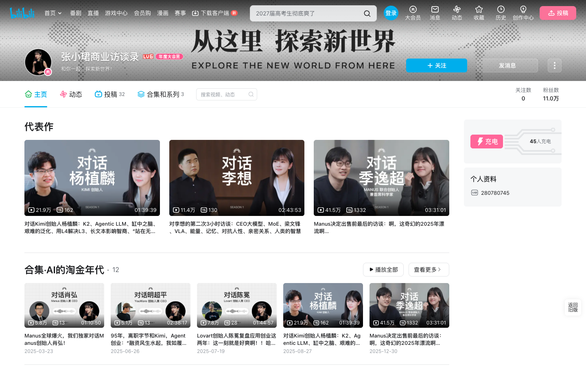

# 张小珺商业访谈录: 长访谈认知代谢公开包

这是一个围绕「张小珺商业访谈录」长访谈素材生成的认知代谢数据包。它不是访谈逐字稿仓库，也不是主持人人格 Agent，而是一套把长访谈转成可复用知识资产的工作样例。

本仓库当前包含 26 期视频的来源索引、结构化 episode cards、跨集 JSONL 数据、156 张认知边界卡、HTML 工作台、处理协议和复现脚本。

## 原始账号

- B站主页：[张小珺商业访谈录](https://space.bilibili.com/280780745)



## 可以直接使用的内容

- `data/source_videos.json`: 原始 Bilibili 视频来源索引，含 BV 号、标题、发布时间、时长和原始链接。
- `data/structured/episodes/*.json`: 公开安全版 episode card，移除了原始字幕证据、ASR segment 和本地路径。
- `data/structured/*.jsonl`: claim / mental model / decision rule / question / entity 的跨集索引，移除了逐字证据字段。
- `data/structured/synthesis/cognitive_boundary_cards.md`: 156 张认知边界卡，用于发现知识增量、认识变化和行动修正。
- `data/structured/synthesis/index.html`: 可本地打开的 HTML 工作台。
- `protocol/长素材认知代谢协议.md`: 后续处理其他长访谈、播客、课程资料时可复用的协议。
- `tools/`: 本次工作流用到的脚本。

## 项目沉淀

- `docs/PROJECT_LEDGER.md`: 本项目最值得复用和维护的资产总账。
- `docs/RUNBOOK_NEW_MATERIAL.md`: 下一批视频、播客、访谈资料的处理手册。
- `docs/ROADMAP_AND_INTEGRATIONS.md`: 流程优化和系统连接路线图。
- `docs/OPTIMIZATION_INBOX.md`: 后续优化点的固定入口。

## 有意不包含的内容

本仓库不包含完整字幕、逐字稿、SRT、ASR segment JSON、chunk 级中间抽取缓存或音视频文件。

原因很简单：原视频、音频、字幕和访谈内容的权利属于原作者、平台和相关权利人。这里公开的是处理方法、结构化索引和分析性笔记；如果你需要完整转写文字，请在确认自己拥有处理权限的前提下，在本地生成。

`data/transcripts/README.md` 里保留了这一边界说明。

## 快速查看

直接用浏览器打开：

```text
data/structured/synthesis/index.html
```

这个 HTML 是静态文件，不需要后端服务。

## 数据边界

这些结果来自 ASR 字幕和 LLM 结构化处理，存在以下限制：

- ASR 可能误识别人名、英文、术语和公司名。
- timestamp 用于回到原视频复核，不等于法律意义上的引用授权。
- 公开数据移除了逐字证据字段，所以需要严肃引用时应回到原视频核对。
- 认知边界卡是分析性笔记，不是对被访者或主持人的完整观点复刻。

## 复现流程

如果你有权处理相应视频材料，可按这个流程复现：

```bash
python tools/zhangxiaojun_bilibili_transcripts.py --all-videos
python tools/zhangxiaojun_knowledge_extract.py --input-dir data/zhangxiaojun-transcripts --output-dir data/zhangxiaojun-transcripts/structured --bvids all --workers 4
python tools/build_long_interview_cognitive_assets.py --root data/zhangxiaojun-transcripts/structured
python tools/build_cognitive_html_viewer.py --synthesis-dir data/zhangxiaojun-transcripts/structured/synthesis
python tools/export_public_release.py --force
```

注意：结构化抽取脚本使用了本地 `llm_router` 接口；如果你在自己的环境运行，需要把 `chat` 调用替换成自己的 LLM provider。

## 目录结构

```text
.
├── data/
│   ├── source_videos.json
│   ├── transcripts/
│   │   └── README.md
│   └── structured/
│       ├── episodes/
│       ├── episodes_md/
│       ├── claims.jsonl
│       ├── mental_models.jsonl
│       ├── decision_rules.jsonl
│       ├── questions.jsonl
│       ├── entities.jsonl
│       └── synthesis/
├── protocol/
├── tools/
├── DATA_LICENSE.md
├── LICENSE
└── NOTICE.md
```

## 适合怎么用

最有价值的用法不是把它当摘要看完，而是把每张认知边界卡拿来做三件事：

1. 问它新增了什么知识。
2. 问它修正了什么认识。
3. 问它会如何改变下一次判断、提问、写作或行动。

这也是这套公开包的核心贡献：把长访谈从「信息消费」转成「认知代谢」。
